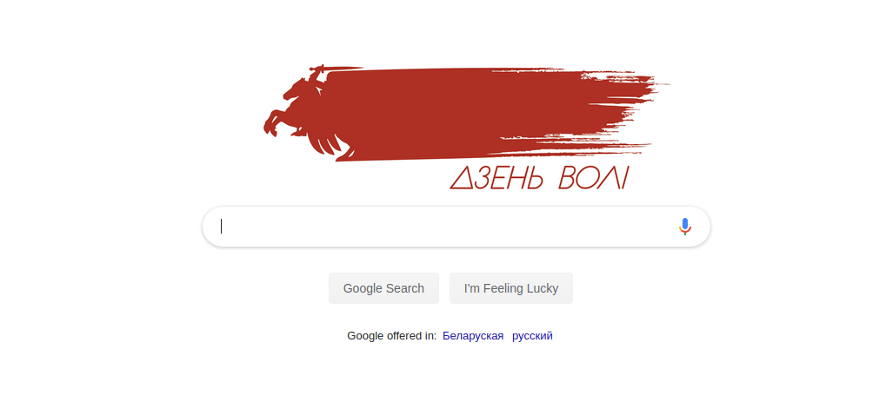
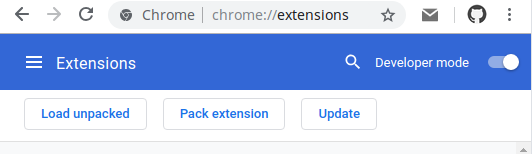

# Беларускі дудл да 101-годдзя абвяшчэння БНР

Chrome расшырэнне, якое змяняе звычайны лагатып Google на старонкі пошуку
на афіцыйны лагатып "Дня Волі" 2019.

Прыклад, як выглядае новая старонка пошука:



## Усталяваць

1. Спампуйце або скланіруйце расшырэнне.
Спампаваць aрхіў з расшырэннем можна тут https://github.com/vtsykun/bnr-doodle-for-google/archive/master.zip

```
git clone https://github.com/vtsykun/bnr-doodle-for-google.git
```

2. Перайдіце да старонкі расшырэнняў `chrome://extensions`

3. Уключыць рэжым распрацоўніка (Developer mode.)



4. Націсніце кнопку `Load unpacked` і абярыце папку з расшырэннем.

## Прапанаваць заувагі і ідэі
Прапанаваць заувагі і ідэі можна праз [Pull Request](https://github.com/vtsykun/bnr-doodle-for-google/pulls)
або [Issue](https://github.com/vtsykun/bnr-doodle-for-google/issues)

## Лагатып на стартавай старонкі

Chrome забараняе выконваць `content_scripts` на новай укладцы або стартавай старонкі
https://codereview.chromium.org/2978953002/

```
Extensions wishing to modify the New Tab Page should do so through the
use of the chrome url overrides [1] API, not through content scripts.
Disallow content script injection on the New Tab Page.
```

## License

The MIT License.
